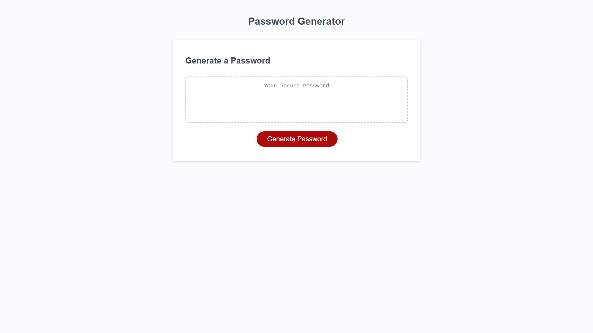

# Super-Secure-Passwords

## Description
Repeating passwords or having passwords that are too similar is dangerous. When making accounts across multiple different websites, creating passwords can become challenging. This is where a password generator comes in handy. Super Secure Passwords is a password generator application designed for creating strong and unique passwords.

### Usage
Users can click on the "Generate Password" button to begin. After, a series of prompts will appear and will require the user to respond to all options. First, the users must select how many characters they would like the generated password to contain. The generated password can have no less than 8 characters and no more than 128 characters. An alert will follow if the user does not select a number of characters within the range, or if the user's selection is not a number. Next, the user must confirm if they would like the generated password to contain lowercase letters, uppercase letters, numbers, and/or special characters. When all options have been answered, the password will generate based off the users selections.  

#### Preview of Application

##### Link to Application
https://pwoods125.github.io/Super-Secure-Passwords/
